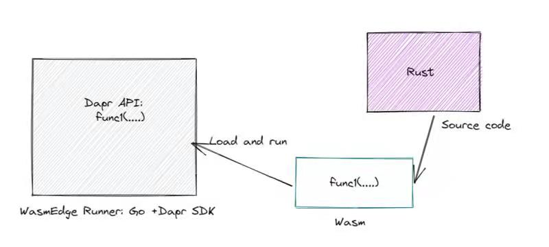

# wasmedge-dapr-sdk

This project demonstrate calling Dapr Api in WASM format, we can run a wasm file call Dapr Api and get results.



## server 

A simple Dapr Server Instance 

```
./run_api_go.sh
```

## wasm

A wasm project, which will call Dapr API in WASM format 

```
./compile.sh
```

## hostfunc.go 

A wrapper for WasmEdge, which will load wasm file, and invoke Dapr API for wasm 

```
./run_hostfunc.sh
```

## Invoke API 

```
curl -v http://127.0.0.1:8080/api/hello
```

